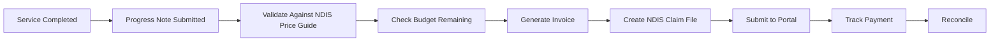
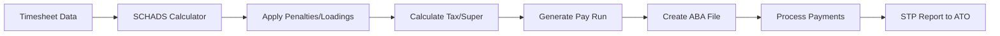

# Finance Department Module - Implementation Plan

**Based on:** Finance Department Module Brief  
**Priority:** CRITICAL - Currently 0 invoices generated, blocking revenue  
**Implementation Date:** January 29, 2025

---

## 🎯 MODULE OBJECTIVES

1. **Automate Billing:** NDIS-compliant participant invoicing
2. **Payroll Processing:** SCHADS Award-compliant staff payments  
3. **Compliance:** ATO STP, Fair Work, Superannuation requirements
4. **Integration:** NDIS Portal, Banking, Xero accounting
5. **Reconciliation:** Payment tracking and debt recovery

---

## 🏗️ IMPLEMENTATION PHASES

### Phase 1: Core Infrastructure (Week 1)
- Database schema for financial entities
- Invoice generation from services
- Basic billing workflows
- Payment tracking

### Phase 2: Payroll System (Week 2)
- SCHADS Award calculator
- Timesheet processing
- Pay run generation
- ABA file export

### Phase 3: Compliance & Integration (Week 3)
- ATO STP reporting
- NDIS Portal integration
- Xero synchronization
- Audit logging

---

## 📊 DATABASE SCHEMA REQUIREMENTS

### Core Financial Tables:
```sql
-- Invoices & Billing
invoices (
  id, participant_id, invoice_number, date_issued,
  total_amount, gst_amount, status, due_date,
  ndis_claim_reference, payment_received_date
)

invoice_items (
  id, invoice_id, service_id, description,
  quantity, unit_price, total, ndis_item_number
)

-- Payroll
pay_runs (
  id, period_start, period_end, status,
  total_gross, total_tax, total_super, total_net
)

pay_slips (
  id, pay_run_id, staff_id, gross_pay, tax,
  super, net_pay, ytd_gross, ytd_tax
)

-- SCHADS Calculations
award_calculations (
  id, staff_id, base_rate, casual_loading,
  saturday_penalty, sunday_penalty, public_holiday,
  overtime_rate, allowances
)

-- Reconciliation
payment_reconciliation (
  id, invoice_id, amount_received, date_received,
  method, reference, bank_statement_id
)

-- Compliance
stp_submissions (
  id, pay_run_id, submission_date, ato_reference,
  status, response
)
```

---

## 🔄 CRITICAL WORKFLOWS

### 1. **Participant Billing Workflow**


**Implementation Steps:**
1. Auto-generate invoices from completed services
2. Validate against NDIS price limits
3. Check participant budget availability
4. Create PDF invoice + CSV claim file
5. Track payment status
6. Auto-reconcile bank deposits

### 2. **Payroll Processing Workflow**


**SCHADS Award Calculations:**
```javascript
// Base rates + loadings
const calculatePay = (hours, level, type) => {
  const baseRate = SCHADS_RATES[level];
  let totalPay = 0;
  
  // Casual loading (25%)
  if (type === 'casual') {
    totalPay += hours.ordinary * baseRate * 1.25;
  }
  
  // Saturday penalty (150%)
  totalPay += hours.saturday * baseRate * 1.5;
  
  // Sunday penalty (200%)
  totalPay += hours.sunday * baseRate * 2.0;
  
  // Public holiday (250%)
  totalPay += hours.publicHoliday * baseRate * 2.5;
  
  // Overtime rates
  totalPay += hours.overtime1 * baseRate * 1.5; // First 2 hours
  totalPay += hours.overtime2 * baseRate * 2.0; // After 2 hours
  
  return totalPay;
};
```

---

## 🎨 UI COMPONENTS NEEDED

### 1. **Finance Dashboard**
```typescript
const FinanceDashboard = () => {
  return (
    <div className="finance-dashboard">
      {/* Revenue Overview */}
      <MetricCard title="Revenue This Month" value="$125,430" trend="+12%" />
      <MetricCard title="Outstanding Invoices" value="$45,200" status="warning" />
      <MetricCard title="Payroll This Fortnight" value="$87,650" />
      <MetricCard title="Budget Utilisation" value="78%" />
      
      {/* Quick Actions */}
      <QuickActions>
        <Button>Generate Invoices</Button>
        <Button>Process Pay Run</Button>
        <Button>NDIS Claims</Button>
        <Button>Bank Reconciliation</Button>
      </QuickActions>
      
      {/* Compliance Status */}
      <ComplianceWidget>
        <StatusItem label="STP Submission" status="current" />
        <StatusItem label="Super Payment" dueIn="5 days" />
        <StatusItem label="BAS Quarter" dueIn="28 days" />
      </ComplianceWidget>
    </div>
  );
};
```

### 2. **Invoice Generation Interface**
```typescript
const InvoiceGenerator = () => {
  return (
    <Card>
      <CardHeader>
        <CardTitle>Generate Participant Invoices</CardTitle>
      </CardHeader>
      <CardContent>
        <DateRangePicker label="Service Period" />
        <Select label="Participant" multiple />
        <CheckboxGroup>
          <Checkbox>Validate NDIS Pricing</Checkbox>
          <Checkbox>Check Budget Limits</Checkbox>
          <Checkbox>Include GST</Checkbox>
        </CheckboxGroup>
        <Button>Preview Invoices</Button>
        <Button variant="primary">Generate & Send</Button>
      </CardContent>
    </Card>
  );
};
```

### 3. **Payroll Processing Interface**
```typescript
const PayrollProcessor = () => {
  return (
    <div className="payroll-interface">
      <PayPeriodSelector />
      <TimesheetSummary />
      <SCHADSCalculator />
      <PayRunPreview />
      <ComplianceChecks />
      <PaymentMethods>
        <Option>Generate ABA File</Option>
        <Option>PayID/OSKO</Option>
        <Option>Manual Transfer</Option>
      </PaymentMethods>
    </div>
  );
};
```

---

## 🔧 INTEGRATION REQUIREMENTS

### 1. **NDIS Portal Integration**
```javascript
// NDIS Bulk Claim Submission
const submitNDISClaim = async (invoices) => {
  const claimFile = generateNDISCSV(invoices);
  const response = await ndisAPI.submitBulkClaim(claimFile);
  return trackClaimStatus(response.referenceNumber);
};
```

### 2. **Banking Integration (ABA File)**
```javascript
// Generate ABA file for bank processing
const generateABAFile = (payRun) => {
  const header = createABAHeader();
  const transactions = payRun.payslips.map(slip => 
    createABATransaction(slip)
  );
  const trailer = createABATrailer(transactions);
  return [header, ...transactions, trailer].join('\n');
};
```

### 3. **Xero Accounting Sync**
```javascript
// Sync invoices with Xero
const syncWithXero = async (invoice) => {
  const xeroInvoice = {
    Type: 'ACCREC',
    Contact: { ContactID: invoice.participant.xeroId },
    LineItems: invoice.items.map(mapToXeroLineItem),
    Date: invoice.date,
    DueDate: invoice.dueDate,
    Reference: invoice.ndisClaimReference
  };
  return await xeroAPI.createInvoice(xeroInvoice);
};
```

---

## ⚡ AUTOMATION FEATURES

### 1. **Auto-Invoice Generation**
- Trigger: Service completion + progress note
- Validation: NDIS price guide compliance
- Frequency: Weekly batch or on-demand
- Output: PDF + CSV + Xero sync

### 2. **Smart Payment Matching**
- Bank feed integration
- Fuzzy matching on amount/date/reference
- Auto-reconciliation confidence scoring
- Exception handling for mismatches

### 3. **Compliance Automation**
- STP submission after each pay run
- Super payment reminders
- BAS preparation quarterly
- Award compliance audit trail

---

## 📈 KPIs & METRICS

### Financial Health:
- **Revenue Growth:** Month-over-month trend
- **Cash Flow:** Receivables vs Payables
- **DSO:** Days Sales Outstanding
- **Collection Rate:** % invoices paid on time

### Operational Efficiency:
- **Invoice Accuracy:** % requiring adjustment
- **Claim Rejection Rate:** NDIS portal rejections
- **Payroll Accuracy:** Corrections per pay run
- **Processing Time:** Hours saved through automation

### Compliance:
- **STP Compliance:** % on-time submissions
- **Award Compliance:** Audit pass rate
- **Super Guarantee:** Payment timeliness
- **Document Retention:** 7-year compliance

---

## 🚨 RISK MITIGATION

### Critical Risks:
1. **Over-claiming:** Automated budget checks
2. **Award Breaches:** Real-time SCHADS validation
3. **Tax Compliance:** Automated STP reporting
4. **Cash Flow:** Aged debtor alerts

### Mitigation Strategies:
- Pre-submission validation rules
- Approval workflows for exceptions
- Audit logging all financial transactions
- Regular compliance reporting

---

## 🎯 SUCCESS CRITERIA

### Week 1 Targets:
- ✅ Generate first automated invoice
- ✅ Process test pay run
- ✅ Export ABA file successfully

### Month 1 Targets:
- 📊 100% service-to-invoice automation
- 💰 95% payment reconciliation accuracy
- 📋 Zero compliance breaches
- ⏱️ 80% reduction in processing time

### Quarter 1 Targets:
- 💵 $500k+ processed through system
- 🎯 98% invoice accuracy
- ✅ Full NDIS portal integration
- 🔄 Complete Xero synchronization

---

## 📋 IMPLEMENTATION CHECKLIST

### Database & Backend:
- [ ] Create financial schema tables
- [ ] Build invoice generation service
- [ ] Implement SCHADS calculator
- [ ] Create pay run processor
- [ ] Add reconciliation engine
- [ ] Build compliance reporting

### Frontend:
- [ ] Finance dashboard
- [ ] Invoice generator UI
- [ ] Payroll processor UI
- [ ] Reconciliation interface
- [ ] Compliance monitoring
- [ ] Report builder

### Integrations:
- [ ] NDIS Portal API/CSV
- [ ] ABA file generator
- [ ] Xero API connection
- [ ] ATO STP integration
- [ ] Bank feed import
- [ ] Super clearing house

### Testing:
- [ ] Invoice calculation accuracy
- [ ] SCHADS award compliance
- [ ] Payment processing
- [ ] Reconciliation matching
- [ ] Compliance reporting
- [ ] End-to-end workflow

---

## 🚀 IMMEDIATE NEXT STEPS

1. **Create Financial Database Schema** (Today)
2. **Build Invoice Generation Service** (Today)
3. **Implement Basic Billing UI** (Today)
4. **Test Invoice Creation** (Tomorrow)
5. **Add SCHADS Calculator** (This Week)

---

*Implementation Plan Created: January 29, 2025*  
*Priority: CRITICAL - Revenue Generation Blocked*  
*Target: Operational Finance Module in 3 Weeks*