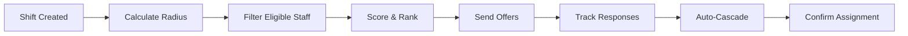

# Service Delivery Department Module - Implementation Plan

**Based on:** Service Delivery Department Module Brief  
**Priority:** CRITICAL - Core operational functionality  
**Implementation Date:** January 29, 2025

---

## 🎯 MODULE OBJECTIVES

1. **Smart Staff Allocation:** Match staff within 20-30 min radius with skill matching
2. **Shift Management:** Complete lifecycle from creation to billing
3. **Clock-In/Out:** Geo-fenced attendance tracking with mobile app
4. **Timesheet Automation:** Auto-generate from attendance data
5. **Casual Workforce:** Fortnightly unavailability management
6. **Billing Integration:** Map completed shifts to NDIS codes

---

## 🏗️ IMPLEMENTATION PHASES

### Phase 1: Core Infrastructure (Immediate)
- Enhanced shift management tables
- Staff availability tracking
- Geo-location services
- Shift offer/response system

### Phase 2: Operational Features (Week 1)
- Clock-in/out functionality
- Timesheet generation
- Allocation algorithm
- Mobile app API

### Phase 3: Optimization (Week 2)
- Route optimization
- Performance analytics
- Predictive scheduling
- Advanced reporting

---

## 📊 DATABASE SCHEMA ENHANCEMENTS

### New Tables Required:
```sql
-- Shift Offers & Responses
shift_offers (
  id, shift_id, staff_id, offer_rank, 
  offered_at, expires_at, response_status,
  responded_at, decline_reason
)

-- Staff Availability/Unavailability
staff_unavailability (
  id, staff_id, date_from, date_to,
  submission_period, reason, is_recurring,
  submitted_at, approved_by
)

-- Attendance Tracking
shift_attendance (
  id, shift_id, staff_id, 
  clock_in_time, clock_in_location, clock_in_lat, clock_in_lng,
  clock_out_time, clock_out_location, clock_out_lat, clock_out_lng,
  actual_duration, travel_time, break_time,
  geo_fence_violations, notes
)

-- Allocation Scoring
staff_allocation_scores (
  id, shift_id, staff_id,
  distance_score, skills_score, preference_score,
  continuity_score, reliability_score, cost_score,
  total_score, rank
)

-- Billing Lines
billing_lines (
  id, shift_id, timesheet_id, participant_id,
  ndis_item_number, quantity, unit_price,
  total_amount, claim_reference, status
)
```

---

## 🔄 CRITICAL WORKFLOWS

### 1. **Smart Staff Allocation Workflow**


**Allocation Algorithm:**
```javascript
const allocateStaff = async (shiftId) => {
  // 1. Get shift details and participant location
  const shift = await getShift(shiftId);
  const participantLocation = await getParticipantLocation(shift.participantId);
  
  // 2. Filter eligible staff
  const eligibleStaff = await filterStaff({
    maxDistance: 30, // km
    requiredCerts: shift.requiredCertifications,
    availability: shift.dateTime,
    fatigueCompliant: true
  });
  
  // 3. Score and rank
  const scoredStaff = eligibleStaff.map(staff => ({
    ...staff,
    scores: {
      distance: calculateDistanceScore(staff.location, participantLocation),
      skills: calculateSkillsMatch(staff.skills, shift.requiredSkills),
      continuity: calculateContinuityScore(staff.id, shift.participantId),
      reliability: staff.reliabilityScore,
      cost: calculateCostScore(staff.hourlyRate)
    }
  }));
  
  // 4. Send offers to top candidates
  const topCandidates = scoredStaff.sort((a, b) => 
    b.totalScore - a.totalScore
  ).slice(0, 5);
  
  return sendShiftOffers(topCandidates, shiftId);
};
```

### 2. **Clock-In/Out with Geo-Fencing**
```javascript
const clockIn = async (shiftId, staffId, location) => {
  // Validate geo-fence
  const shift = await getShift(shiftId);
  const distance = calculateDistance(
    location,
    shift.participantLocation
  );
  
  if (distance > GEO_FENCE_RADIUS) {
    return {
      success: false,
      reason: 'Outside geo-fence',
      requiresOverride: true
    };
  }
  
  // Record attendance
  return await recordAttendance({
    shiftId,
    staffId,
    clockInTime: new Date(),
    clockInLocation: location,
    clockInLat: location.lat,
    clockInLng: location.lng
  });
};
```

### 3. **Fortnightly Unavailability System**
```javascript
const enforceUnavailabilitySubmission = async () => {
  const cutoffDate = getFortnightlyCutoff();
  const casualStaff = await getCasualStaff();
  
  for (const staff of casualStaff) {
    const hasSubmitted = await checkUnavailabilitySubmission(
      staff.id,
      cutoffDate
    );
    
    if (!hasSubmitted) {
      // Send reminder
      await sendUnavailabilityReminder(staff);
      
      // After deadline, mark as available
      if (new Date() > cutoffDate) {
        await markAsAvailable(staff.id);
      }
    }
  }
};
```

---

## 🎨 UI COMPONENTS NEEDED

### 1. **Service Delivery Coordinator Dashboard**
```typescript
const CoordinatorDashboard = () => {
  return (
    <div className="coordinator-dashboard">
      {/* Smart Allocation Panel */}
      <SmartAllocationPanel>
        <ShiftsList unallocated />
        <StaffRecommendations />
        <QuickAllocateButton />
      </SmartAllocationPanel>
      
      {/* Live Shift Board */}
      <LiveShiftBoard>
        <ShiftCard status="in-progress" />
        <ShiftCard status="starting-soon" />
        <IssueAlerts />
      </LiveShiftBoard>
      
      {/* Map View */}
      <MapView>
        <StaffLocations realTime />
        <ParticipantLocations />
        <RouteOptimization />
      </MapView>
    </div>
  );
};
```

### 2. **Staff Mobile App Interface**
```typescript
const StaffMobileApp = () => {
  return (
    <MobileLayout>
      {/* Shift Offers */}
      <ShiftOffersList>
        <OfferCard>
          <ParticipantInfo />
          <ShiftDetails />
          <TravelDistance />
          <AcceptButton />
          <DeclineButton />
        </OfferCard>
      </ShiftOffersList>
      
      {/* Clock In/Out */}
      <ClockInOutPanel>
        <GeoLocationVerification />
        <ClockInButton />
        <TasksList />
        <ProgressNoteForm />
        <ClockOutButton />
      </ClockInOutPanel>
      
      {/* Unavailability */}
      <UnavailabilityForm>
        <DateRangePicker />
        <ReasonSelector />
        <RecurringOption />
        <SubmitButton />
      </UnavailabilityForm>
    </MobileLayout>
  );
};
```

### 3. **Allocation Algorithm Interface**
```typescript
const AllocationInterface = () => {
  return (
    <Card>
      <CardHeader>
        <CardTitle>Smart Staff Allocation</CardTitle>
      </CardHeader>
      <CardContent>
        <ShiftDetails />
        <AllocationCriteria>
          <RadiusSelector default={30} />
          <SkillRequirements />
          <CertificationRequirements />
        </AllocationCriteria>
        <StaffRankingTable>
          <columns>
            <RankColumn />
            <StaffNameColumn />
            <DistanceColumn />
            <ScoreColumn />
            <ActionsColumn />
          </columns>
        </StaffRankingTable>
        <AllocationActions>
          <AutoAllocateButton />
          <ManualSelectButton />
          <BroadcastButton />
        </AllocationActions>
      </CardContent>
    </Card>
  );
};
```

---

## ⚡ AUTOMATION FEATURES

### 1. **Auto-Allocation Engine**
- Runs every 15 minutes for unallocated shifts
- Considers staff fatigue rules (max hours/week)
- Respects participant preferences
- Cascades offers if no response in 2 hours

### 2. **Timesheet Generation**
- Triggers on clock-out
- Calculates actual hours vs scheduled
- Applies SCHADS rates automatically
- Includes travel time and allowances

### 3. **Billing Line Creation**
- Maps completed shifts to NDIS codes
- Applies price limits and TTP rules
- Handles cancellation charges
- Routes to appropriate payer

### 4. **Route Optimization**
- Groups shifts by geography
- Minimizes travel between appointments
- Suggests efficient daily routes
- Alerts for inefficient allocations

---

## 📈 KPIs & METRICS

### Service Delivery:
- **Fill Rate:** % of shifts successfully allocated
- **Time to Fill:** Average hours from creation to allocation
- **Cancellation Rate:** % of shifts cancelled <24hrs
- **Continuity Index:** Same staff serving participant

### Workforce:
- **Utilization:** Billable hours vs available hours
- **Travel Efficiency:** Average km between shifts
- **Fatigue Compliance:** % adhering to max hours
- **Unavailability Compliance:** % submitting on time

### Quality:
- **Clock-In Compliance:** % on-time arrivals
- **Note Completion:** % with progress notes
- **Incident Rate:** Per 100 shifts
- **Satisfaction Score:** Participant feedback

### Financial:
- **Revenue per Hour:** Total billed / roster hours
- **Cost per Shift:** Including travel and admin
- **Claim Rejection Rate:** % NDIS claims rejected
- **Margin:** Revenue minus direct costs

---

## 🔧 INTEGRATION REQUIREMENTS

### 1. **Mobile App API**
```javascript
// Shift offer notifications
POST /api/mobile/shift-offers
GET  /api/mobile/my-shifts
POST /api/mobile/shift-response

// Attendance
POST /api/mobile/clock-in
POST /api/mobile/clock-out
POST /api/mobile/progress-note

// Availability
GET  /api/mobile/my-availability
POST /api/mobile/unavailability
```

### 2. **Geolocation Services**
```javascript
// Distance calculation
const calculateDistance = (point1, point2) => {
  // Haversine formula for accurate distance
  const R = 6371; // Earth radius in km
  const dLat = toRad(point2.lat - point1.lat);
  const dLon = toRad(point2.lng - point1.lng);
  
  const a = Math.sin(dLat/2) * Math.sin(dLat/2) +
    Math.cos(toRad(point1.lat)) * Math.cos(toRad(point2.lat)) *
    Math.sin(dLon/2) * Math.sin(dLon/2);
  
  const c = 2 * Math.atan2(Math.sqrt(a), Math.sqrt(1-a));
  return R * c;
};
```

### 3. **NDIS Billing Integration**
```javascript
// Map shift to NDIS item
const mapToNDISItem = (shift) => {
  const mapping = {
    'personal_care': '01_011_0107_1_1',
    'community_access': '04_104_0125_6_1',
    'overnight_support': '01_020_0107_1_1'
  };
  
  return {
    itemNumber: mapping[shift.serviceType],
    quantity: shift.duration / 60, // Convert to hours
    unitPrice: getNDISPrice(mapping[shift.serviceType])
  };
};
```

---

## 🚨 RISK MITIGATION

### Critical Risks:
1. **No-shows:** Auto-escalation and replacement
2. **Double-booking:** Real-time conflict detection
3. **Fatigue breaches:** Preventive blocking
4. **Geo-fence gaming:** Random audits and photos

### Mitigation Strategies:
- Predictive no-show modeling
- Buffer time between shifts
- Mandatory rest periods
- Multi-factor attendance verification

---

## 🎯 SUCCESS CRITERIA

### Week 1 Targets:
- ✅ Allocate 100% of shifts within radius
- ✅ 90% clock-in compliance
- ✅ Auto-generate all timesheets
- ✅ Zero double-bookings

### Month 1 Targets:
- 📊 95% fill rate
- ⏱️ <2 hour average time-to-fill
- 📍 100% geo-fence compliance
- 💰 98% billing accuracy

### Quarter 1 Targets:
- 🎯 85% first-offer acceptance
- 🚗 20% travel reduction
- 📈 15% utilization improvement
- ⭐ 4.5+ satisfaction score

---

## 📋 IMPLEMENTATION CHECKLIST

### Database & Backend:
- [ ] Create allocation tables
- [ ] Build matching algorithm
- [ ] Implement geo-fencing
- [ ] Create attendance tracking
- [ ] Build timesheet generator
- [ ] Add billing line creation

### Frontend:
- [ ] Coordinator dashboard
- [ ] Allocation interface
- [ ] Live shift board
- [ ] Map view
- [ ] Mobile app APIs
- [ ] Reporting dashboards

### Integrations:
- [ ] Google Maps API
- [ ] Push notifications
- [ ] Calendar sync
- [ ] NDIS price guide
- [ ] Finance module
- [ ] HR module

### Testing:
- [ ] Allocation accuracy
- [ ] Geo-fence precision
- [ ] Timesheet calculations
- [ ] Billing correctness
- [ ] Mobile app functionality
- [ ] End-to-end workflow

---

## 🚀 IMMEDIATE NEXT STEPS

1. **Enhance Shift Tables** (Today)
2. **Build Allocation Algorithm** (Today)
3. **Create Attendance Tracking** (Today)
4. **Implement Geo-Fencing** (Tomorrow)
5. **Add Mobile APIs** (This Week)

---

*Implementation Plan Created: January 29, 2025*  
*Priority: CRITICAL - Core Service Delivery*  
*Target: MVP in 1 Week, Full System in 3 Weeks*