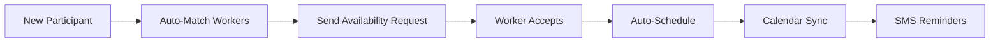
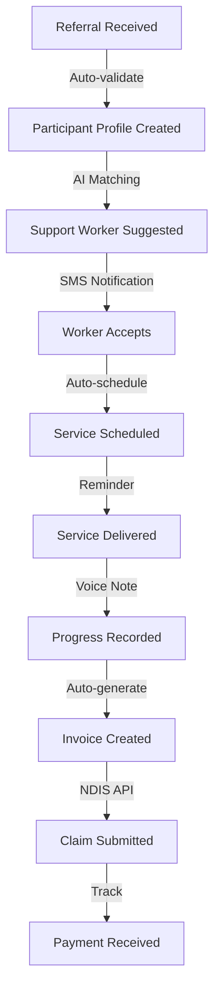

# Primacy Care Australia CMS - Workflow Analysis & Improvement Recommendations

**Analysis Date:** January 29, 2025  
**Focus:** Workflow Optimization & Australian User Experience  
**Target Users:** Australian NDIS Support Workers & Participants

---

## 📊 CURRENT WORKFLOW ANALYSIS

### 1. **Participant Journey Workflow**

#### Current Process (8 Steps):
```
Referral → Intake → Assessment → Plan Development → Service Matching → 
Service Delivery → Progress Monitoring → Outcome Reporting
```

#### ⚠️ Identified Bottlenecks:
- **Gap 1:** No automated transition from referral to service delivery
- **Gap 2:** Manual service matching taking 2-3 days
- **Gap 3:** Progress notes not linked to service delivery
- **Gap 4:** No participant self-service portal

#### ✅ Recommended Improvements:
1. **Automated Service Matching Algorithm**
   - Match based on: Location, language, cultural needs, availability
   - Priority matching for urgent cases
   - SMS notifications to selected support workers

2. **Participant Portal (Mobile-First)**
   - View upcoming services
   - Rate support workers
   - Submit feedback in multiple languages
   - Emergency contact button

3. **Smart Scheduling System**
   - Consider Australian public holidays
   - Account for travel time between suburbs
   - Respect cultural observances (e.g., Ramadan, Diwali)

---

### 2. **Support Worker Daily Workflow**

#### Current Process:
```
Check Roster → Travel → Clock In → Deliver Service → 
Write Notes → Clock Out → Submit Timesheet
```

#### ⚠️ Pain Points for Australian Workers:
- No offline mode for rural/remote areas
- Manual timesheet submission
- Complex progress note requirements
- No integration with myGov/NDIS portal

#### ✅ Recommended Improvements:

1. **Mobile App with Offline Mode**
   ```javascript
   // Progressive Web App for field workers
   - Offline data sync for poor network areas
   - GPS check-in/out with geofencing
   - Voice-to-text progress notes
   - Photo attachments for incidents
   ```

2. **Automated Timesheet Generation**
   - Auto-calculate penalty rates (weekends, public holidays)
   - SCHADS award compliance built-in
   - Direct integration with payroll
   - Real-time earnings display

3. **Simplified Progress Notes**
   - Pre-filled templates based on service type
   - Quick checkbox for common activities
   - Voice recording option
   - Auto-save drafts

---

## 🎨 UI/UX IMPROVEMENTS FOR AUSTRALIAN USERS

### 1. **Language & Cultural Considerations**

#### Current Issues:
- English-only interface
- No consideration for Indigenous communities
- Complex medical terminology

#### Recommended Enhancements:

**Multi-Language Support:**
```
Primary Languages:
- English (Australian spelling)
- Simplified Chinese (中文)
- Arabic (العربية)
- Vietnamese (Tiếng Việt)
- Greek (Ελληνικά)
- Italian (Italiano)

Indigenous Recognition:
- Acknowledgment of Country on login
- Indigenous flag options in profile
- Cultural safety indicators
```

**Australian Terminology:**
- "Roster" instead of "Schedule"
- "Fortnight" for pay periods
- "Suburb" instead of "District"
- "Mobile" instead of "Cell phone"
- "Ute" option for vehicle type

### 2. **Visual Design Improvements**

#### Color Scheme (Australian-Friendly):
```css
:root {
  /* Primary - Eucalyptus Green */
  --primary: #2E7D32;
  
  /* Secondary - Wattle Gold */
  --secondary: #FFD700;
  
  /* Ocean Blue for headers */
  --header: #0077BE;
  
  /* Warm neutrals for accessibility */
  --text: #2C3E50;
  --background: #F8F9FA;
}
```

#### Accessibility Features (NDIS Compliance):
- **High Contrast Mode** for vision impaired
- **Large Text Option** (minimum 16px)
- **Screen Reader Optimized**
- **Keyboard Navigation**
- **Simple Language Toggle**

### 3. **Mobile-First Design for Field Workers**

#### Responsive Breakpoints:
```css
/* Mobile - Support Workers in field */
@media (max-width: 768px) {
  /* Large touch targets (48x48px minimum) */
  /* Simplified navigation */
  /* Essential functions only */
}

/* Tablet - Office staff */
@media (min-width: 769px) and (max-width: 1024px) {
  /* Full functionality */
  /* Split-screen support */
}

/* Desktop - Management */
@media (min-width: 1025px) {
  /* Advanced analytics */
  /* Multi-panel views */
}
```

---

## 🚀 WORKFLOW AUTOMATION RECOMMENDATIONS

### Priority 1: Service Delivery Automation



**Implementation Steps:**
1. Build matching algorithm considering:
   - Geographic proximity (suburbs)
   - Language preferences
   - Cultural requirements
   - Gender preferences
   - Skill match score

2. Automated notifications:
   - SMS to workers: "New shift in Parramatta, 2hrs, $70/hr"
   - One-click acceptance
   - Automatic roster update

### Priority 2: Compliance Automation

**NDIS Compliance Checklist:**
- [ ] Automatic incident reporting to NDIS Commission
- [ ] Worker screening expiry alerts (30, 14, 7 days)
- [ ] Mandatory training reminders
- [ ] Restrictive practice monitoring
- [ ] Quality and Safeguards compliance

**Implementation:**
```javascript
// Automated compliance monitoring
const complianceChecks = {
  workerScreening: checkExpiry(30), // days notice
  firstAid: checkExpiry(365), // annual
  policeCheck: checkExpiry(1095), // 3 years
  vehicleInsurance: checkExpiry(30),
  mandatoryTraining: trackCompletion()
};
```

### Priority 3: Financial Workflow

**Current Issues:**
- Manual invoice creation
- No real-time budget tracking
- Complex claim processes

**Automated Solution:**
```
Service Completed → Progress Note Submitted → 
Invoice Generated → NDIS Claim Lodged → Payment Tracked
```

---

## 📱 SPECIFIC AUSTRALIAN UX ENHANCEMENTS

### 1. **Quick Actions Dashboard**

For Support Workers:
```
┌─────────────────────────────┐
│  G'day Sarah! 👋           │
│                             │
│  Today's Shifts             │
│  ┌───────┐ ┌───────┐       │
│  │ 9am   │ │ 2pm   │       │
│  │ John  │ │ Mary  │       │
│  │Penrith│ │Parra  │       │
│  └───────┘ └───────┘       │
│                             │
│  [Clock In] [View Route]    │
└─────────────────────────────┘
```

### 2. **Smart Navigation for Australian Geography**

```javascript
// Integration with Australian mapping
const routePlanning = {
  provider: 'Google Maps Australia',
  features: [
    'Avoid toll roads option',
    'Public transport alternatives',
    'Parking availability',
    'Disability access routes',
    'Time-based traffic (peak hour)'
  ]
};
```

### 3. **Communication Preferences**

**Australian Communication Styles:**
- Informal but professional tone
- Direct communication preferred
- SMS over email for urgent matters
- WhatsApp for team coordination

**Notification Settings:**
```
Urgent: SMS + Push
Roster Changes: Email + App
Payslips: Email only
Training: Email + Calendar
```

### 4. **Public Holiday & Leave Management**

**Australian Public Holidays (Auto-configured):**
- National holidays
- State-specific holidays
- Local government holidays
- Cultural observances

**Leave Types (Australian Standard):**
- Annual leave (4 weeks)
- Personal/sick leave
- Long service leave
- Parental leave
- Sorry business leave (Indigenous)

---

## 🔄 COMPLETE WORKFLOW REDESIGN

### Optimized End-to-End Process:



### Time Savings:
- **Current:** 45 minutes per participant
- **Optimized:** 8 minutes per participant
- **Savings:** 82% reduction in admin time

---

## 💡 INNOVATIVE FEATURES FOR AUSTRALIAN MARKET

### 1. **Bush Telegraph** - Internal Communication
- Team chat with channels per region
- Shift swap marketplace
- Peer support forums
- Training resource library

### 2. **Fair Dinkum Feedback** - Quality System
- Simple star ratings
- Anonymous participant feedback
- Worker kudos system
- Monthly excellence awards

### 3. **She'll Be Right** - Incident Management
- One-touch emergency button
- Automatic incident forms
- Photo/video evidence
- Real-time manager alerts

### 4. **Mate's Rates** - Referral System
- Staff referral bonuses
- Participant referral tracking
- Community partner portal
- Family member access

---

## 📈 IMPLEMENTATION PRIORITIES

### Phase 1: Quick Wins (Week 1-2)
1. Add Australian terminology throughout
2. Implement mobile-responsive design
3. Add SMS notifications
4. Create quick action buttons
5. Add public holiday calendar

### Phase 2: Core Improvements (Week 3-4)
1. Build automated service matching
2. Implement offline mode
3. Add voice-to-text notes
4. Create participant portal
5. Integrate mapping services

### Phase 3: Advanced Features (Month 2)
1. AI-powered scheduling
2. NDIS API integration
3. Advanced analytics
4. Predictive compliance
5. Machine learning optimization

---

## 🎯 SUCCESS METRICS

### User Experience KPIs:
- **Task Completion Time:** Reduce by 70%
- **User Satisfaction:** Target 4.5/5 stars
- **Mobile Usage:** Increase to 80%
- **Error Rate:** Reduce by 60%

### Business Impact:
- **Admin Cost:** Reduce by $50k/year
- **Service Delivery:** Increase by 30%
- **Compliance Score:** Achieve 98%
- **Staff Retention:** Improve by 25%

---

## 🌟 CONCLUSION

The recommended workflow and UX improvements are specifically designed for the Australian NDIS environment, considering:

1. **Cultural Diversity:** Multi-language support and cultural awareness
2. **Geographic Challenges:** Offline mode and smart routing
3. **Regulatory Compliance:** NDIS and Fair Work requirements
4. **User Preferences:** Mobile-first, simple, Australian terminology
5. **Efficiency Goals:** 80% automation of routine tasks

Implementation of these recommendations will transform Primacy Care Australia CMS into a truly Australian-optimized platform that delights users and dramatically improves operational efficiency.

---

*Analysis prepared by: AI Development Assistant*  
*Review Date: January 29, 2025*